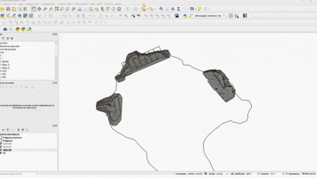
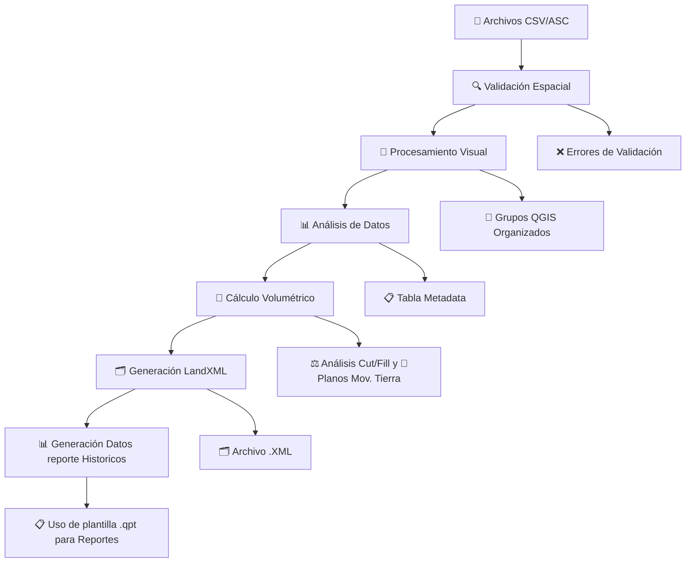
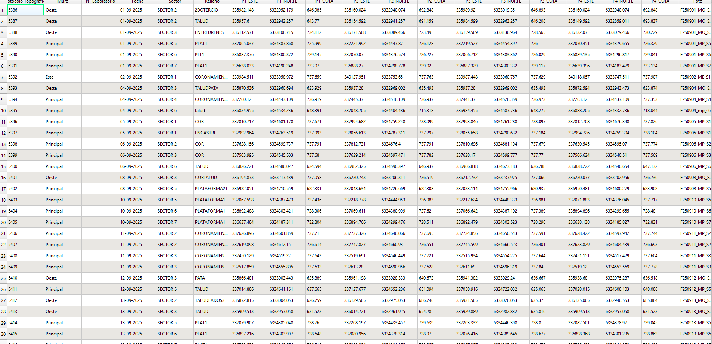
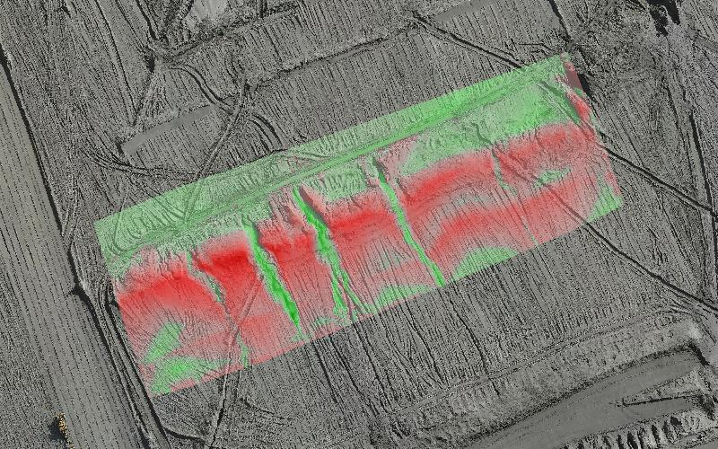
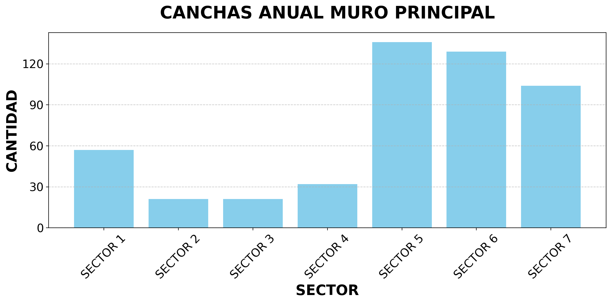
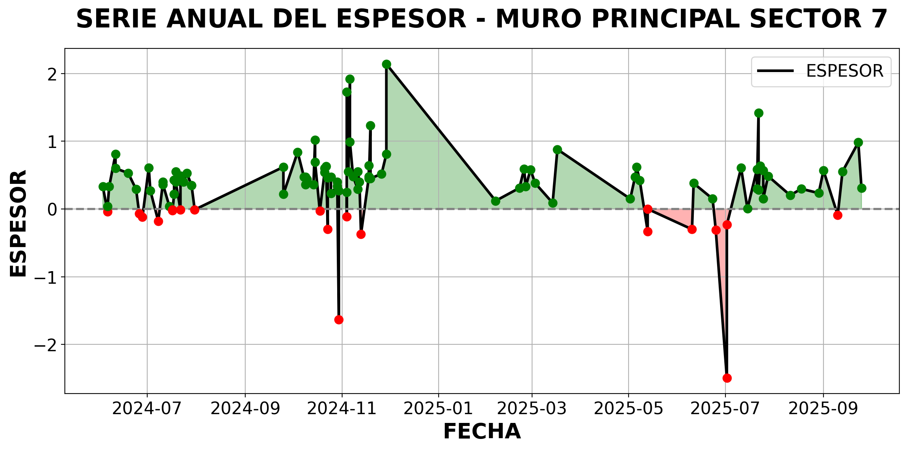
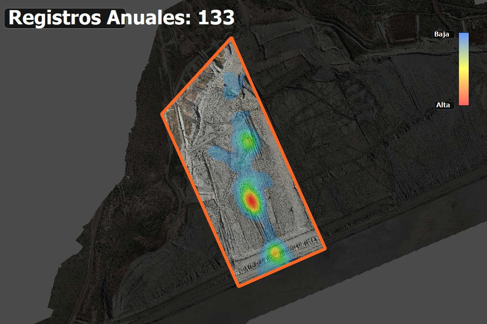
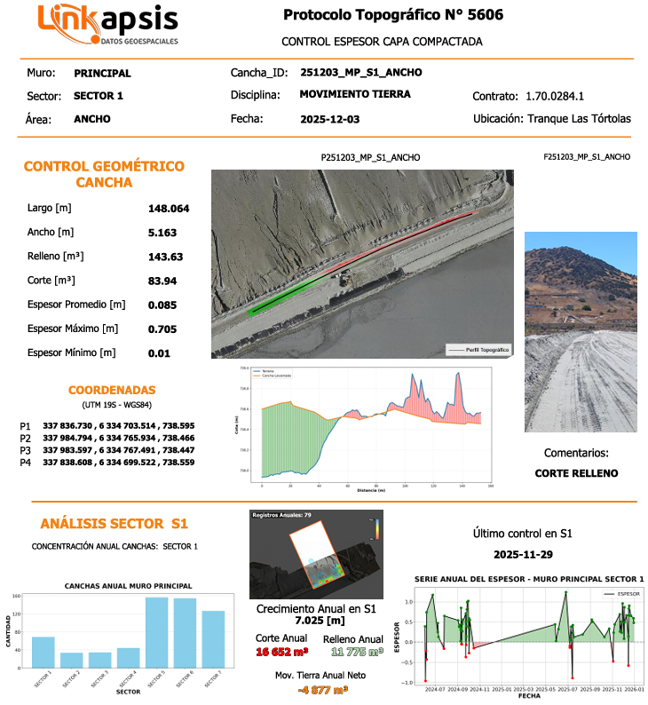

# 🏟️ Canchas Las Tortolas - Plugin QGIS 
---
<p align="center">
  
</p>


<h2 align="center">🚀 Eficiencia Operacional</h2>

<table align="center">
  <tr>
    <th>Método</th>
    <th>Tiempo por Cancha</th>
    <th>Tiempo Total (80 canchas)</th>
    <th>Ahorro</th>
  </tr>
  <tr>
    <td>🧱 CAD Manual</td>
    <td>8–10 min</td>
    <td>≈ 12 horas</td>
    <td>—</td>
  </tr>
  <tr>
    <td>⚙️ Plugin Automatizado</td>
    <td><strong>&lt; 0.1 min</strong></td>
    <td><strong>≈ 5 min</strong></td>
    <td><strong>−99%</strong></td>
  </tr>
</table>

<p align="center">
  
  
</p>

<pre>
Tiempo total (80 canchas)
───────────────────────────────
CAD Manual           ██████████████████████████████████████  ~12 h
Plugin Automatizado  █  ~5 min
</pre>

<p align="center">
📊 <strong>Ahorro estimado:</strong><br>
🚀 Más de <strong>99% menos tiempo</strong> en procesamiento mensual<br>
💪 <strong>De 12 horas a solo 5 minutos</strong> con reportes, triangulaciones y análisis listos
</p>

<h3 align="center">📏 Métricas de Precisión (Diferencia CAD vs Plugin)</h3>

<table align="center">
  <tr>
    <th>Promedio</th>
    <th>Desv.</th>
    <th>Mín</th>
    <th>Máx</th>
    <th>Mediana</th>
  </tr>
  <tr>
    <td><strong>0.0268 m</strong></td>
    <td><strong>0.0379 m</strong></td>
    <td><strong>0.0006 m</strong></td>
    <td><strong>0.1723 m</strong></td>
    <td><strong>0.0102 m</strong></td>
  </tr>
</table>

<p align="center">
📐 <em>Promedio de desviación inferior a 3 cm entre ambos métodos.</em>
</p>


---

## ⭐ Características Principales

### 🔍 1. Validación Espacial Avanzada

* ✅ Normalización automática de nombres a mayúsculas
* ✅ Verificación automática de formato CSV/ASC
* ✅ Validación de sistemas de coordenadas (EPSG:32719)
* ✅ Validación inteligente de nomenclatura con GPKG
* ✅ Control de integridad espacial de archivos
* ✅ Filtrado robusto de archivos RTCM / chequeo / INF
* ✅ Detección de errores de formato topográfico
* ✅ Detección y manejo de archivos con múltiples componentes en nombre

### 🔄 2. Procesamiento Visual Inteligente

* 🎯 Generación automática de grupos QGIS con actualización de fecha
* 🔺 Creación de TIN (Triangulated Irregular Network)
* 🔺 Creación de Poligonos
* 🔺 Creación de Puntos
* 📐 Generación de polígonos a partir de puntos topográficos
* 🎨 Simbología automática por categorías

### 📊 3.1 Análisis de Datos Completo

* 📋 Gestión avanzada de tablas con parseo flexible de nombres
* 📋 Extracción automática de vértices extremos
* 📈 Generación de tabla base con metadata completa
* 🔢 Análisis estadístico de elevaciones

### 📏 3.2 Cálculo Volumétrico Profesional + Pantallazos Movimiento de Tierra

* ⚖️ Análisis incremental Cut/Fill con DEM base
* 📊 Cálculo de volúmenes con precisión topográfica
* 📐 Determinación de espesores mínimos y máximos
* 📈 Reportes estadísticos detallados de volúmenes
* 📸 Generación de pantallazos con colores de corte y relleno

### 🗂️ 3.3 Exportación LandXML

* 📤 Exportación completa a formato LandXML con metadatos correctos
* 🔺 Superficies TIN con nomenclatura estandarizada
* 📊 Integración con flujos de trabajo profesionales CAD
* ✅ Compatibilidad total con sistemas de coordenadas **EPSG:32719**

### 📸 4. Generación Semi-Automática de Reportes

* 🖼️ Generacion de nuevas metricas de analisis de datos historicos 
* 📄 Reportes PDF con firma digital y logos corporativos integrados
* 📊 Gráficos de barras (G1) y series temporales (G2) historicos
* 🔥 Heatmaps historicos profesionales
* 📊 Análisis por sector involucrado


---

## 🔄 Flujo de Trabajo Completo




## 📈 Resultados Generados

### **🎯 Grupos QGIS Organizados**

*[Placeholder para screenshot de grupos generados en QGIS]*

```
Procesamiento_YYYY-MM-DD/
├── 📍 Puntos/
│   ├── Levantamiento_001_puntos
│   ├── Levantamiento_002_puntos
│   └── ...
├── 📐 Polígonos/
│   ├── Levantamiento_001_poligono
│   ├── Levantamiento_002_poligono
│   └── ...
└── 🔺 Triangulaciones/
    ├── Levantamiento_001_TIN
    ├── Levantamiento_002_TIN
    └── ...
```

### **📋 Tabla Base de Datos con Metadata**




| Campo | Tipo | Descripción |
|-------|------|-------------|
| `id_levantamiento` | Integer | ID único del levantamiento |
| `fecha_procesamiento` | Date | Fecha de procesamiento |
| `Muro` | Text | Nombre Muro |
| `Sector` | Text | Nombre Sector |
| `P1` | Double | Coordenadas Punto 1 |
| `P4` | Double | Coordenadas Punto 4 |
| `cota` | Double | Elevaciones |
| `Foto/Plano` | Integer | Nombre Archivo Foto/Plano |
| `Operador` | Text | Nombre Operador |

### **⚖️ Análisis Volumétrico Cut/Fill**

```
Levantamiento: 001
================
Volumen Cut:    +1,234.56 m³
Volumen Fill:   -567.89 m³
Volumen Neto:   +666.67 m³
Espesor Mín:    -2.45 m
Espesor Máx:    +3.78 m
Área Análisis:  5,678.90 m²
```

### **📸 Reportes Visuales Automáticos**

<!-- Imagen grande arriba -->

<p align="center">
  
</p>

<!-- Tres imágenes pequeñas abajo, alineadas en fila -->

<p align="center">
  
  
  
</p>


<h3>🗂️ <strong>Exportación LandXML Profesional</strong></h3>

<pre style="font-size: 10px; line-height: 1.3; background-color: #f6f8fa; padding: 10px; border-radius: 8px; overflow-x: auto;">
&lt;?xml version="1.2" encoding="UTF-8"?&gt;
&lt;LandXML xmlns="http://www.landxml.org/schema/LandXML-1.2"&gt;
  &lt;Project name="Canchas Las Tortolas"&gt;
    &lt;Surface name="Levantamiento_001"&gt;
      &lt;SourceData&gt;
        &lt;Breaklines&gt;
          &lt;Breakline&gt;
            &lt;PntList3D&gt;345678.25 7543210.50 1245.67 ...&lt;/PntList3D&gt;
          &lt;/Breakline&gt;
        &lt;/Breaklines&gt;
      &lt;/SourceData&gt;
      &lt;Definition surfType="TIN"&gt;
        &lt;Pnts&gt;
          &lt;P id="1"&gt;345678.25 7543210.50 1245.67&lt;/P&gt;
          ...
        &lt;/Pnts&gt;
        &lt;Faces&gt;
          &lt;F&gt;1 2 3&lt;/F&gt;
          ...
        &lt;/Faces&gt;
      &lt;/Definition&gt;
    &lt;/Surface&gt;
  &lt;/Project&gt;
&lt;/LandXML&gt;
</pre>

### **🗂️ Reporte Final**





---

## 🤝 Soporte

### **📧 Información de Contacto Linkapsis**

**🏢 Empresa:** Linkapsis  
**👨‍💻 Desarrollador:** Tito Ruiz - Analista de Desarrollo y Procesos  
**📧 Email:** [truizh@linkapsis.com](mailto:truizh@linkapsis.com)  
**🌐 Website:** [www.linkapsis.com](https://www.linkapsis.com)  
**📅 Fecha Desarrollo:** Agosto 2025  


<div align="center">

**🏟️ Canchas Las Tortolas Plugin QGIS**  
*Desarrollado con ❤️ por [Linkapsis](https://www.linkapsis.com)*

</div>
